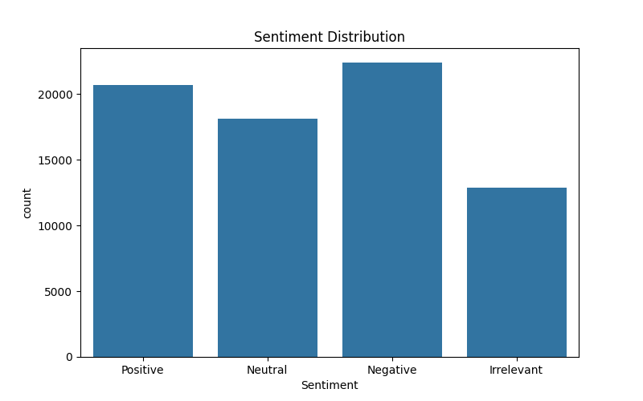
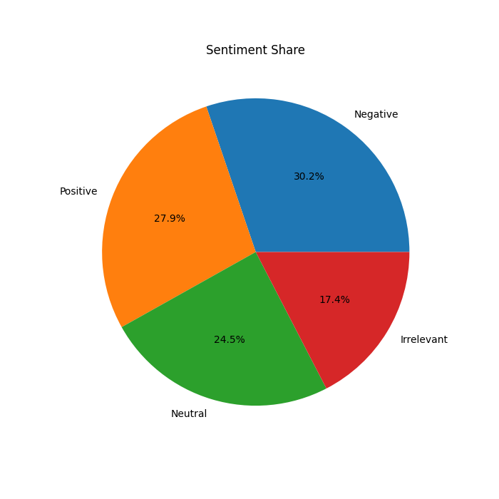
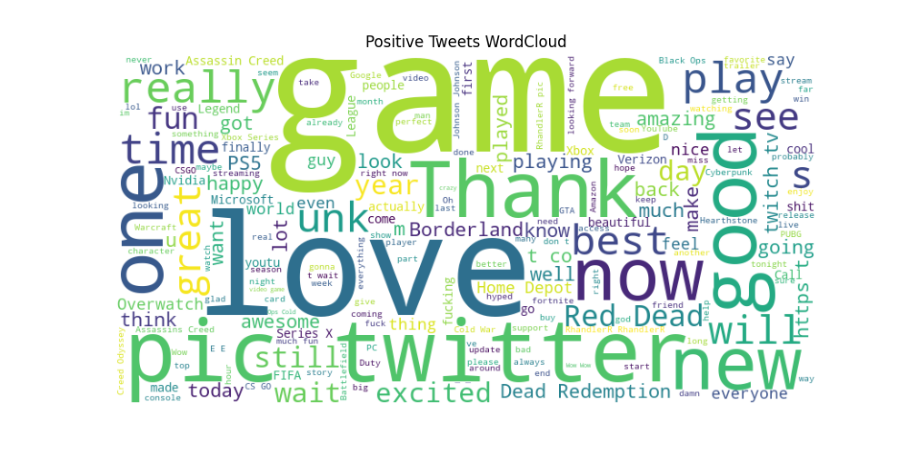
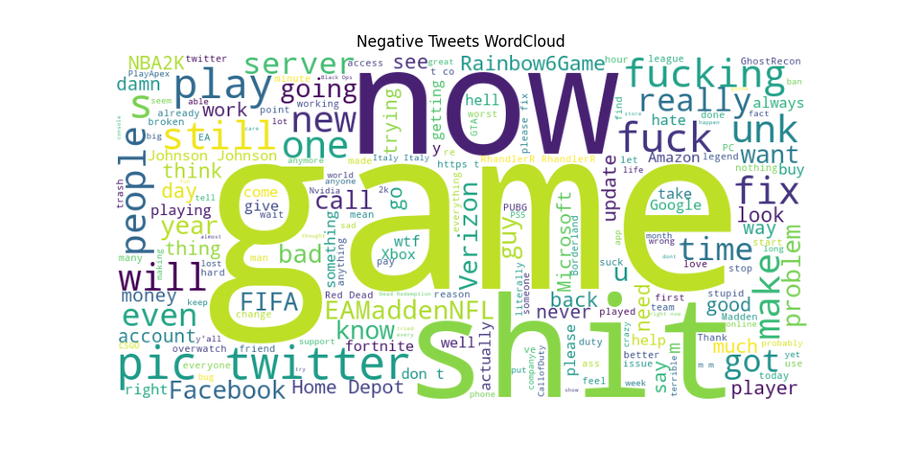
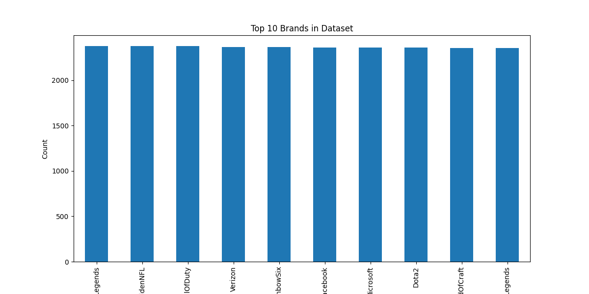

# PRODIGY_DS_04

## Task 04 - Social Media Sentiment Analysis

### Objective
Analyze and visualize sentiment patterns in social media data to understand public opinion and attitudes towards specific topics or brands.

---

## Dataset

Twitter Entity Sentiment Analysis Dataset

Files Used:
- twitter_training.csv
- twitter_validation.csv

---

## Technologies Used

- Python
- Pandas
- Matplotlib
- Seaborn
- WordCloud

---

## Analysis Performed

1. Data Loading and Cleaning
2. Sentiment Distribution Analysis
3. Sentiment Share Visualization
4. Positive Tweets WordCloud
5. Negative Tweets WordCloud
6. Top 10 Brand Analysis

---

## Visualizations

- Sentiment Distribution Bar Chart
- Sentiment Pie Chart
- Positive Tweets WordCloud
- Negative Tweets WordCloud
- Top 10 Brands Chart

---

## Key Insights

- Negative sentiment was the most common sentiment.
- Positive sentiment was close behind.
- Gaming and technology brands appeared frequently.
- Public opinion varied significantly across brands.

---

## Conclusion

This project demonstrates how sentiment analysis can be used to understand customer opinions and social media trends using data visualization techniques.

## Output Screenshots

### Sentiment Distribution

### Sentiment Share

### Positive WordCloud

### Negative WordCloud

### Top Brands

